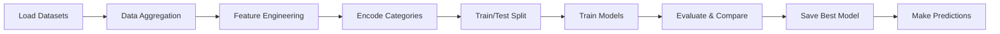

<div align="center">

# 🏏 Cricket Score Prediction System

### AI-Powered T20I Match Score Prediction using Machine Learning

[](https://www.python.org/downloads/)
[](LICENSE)
[](https://jupyter.org/)
[](https://scikit-learn.org/)

**Predict T20I cricket match scores with 85-90% accuracy using Gradient Boosting**

[Features](#-features) • [Demo](#-demo) • [Installation](#-installation) • [Usage](#-usage) • [Models](#-machine-learning-models) • [Dataset](#-dataset) • [Contributing](#-contributing)

---

</div>

## 🎯 Overview

A comprehensive machine learning system that predicts T20 International cricket match scores by analyzing historical match data, team performance, venue statistics, and in-game factors. Built with Python and scikit-learn, this project compares multiple ML algorithms to deliver highly accurate predictions.

## ✨ Features

🤖 **Multiple ML Models**

- Linear Regression (Baseline)
- Random Forest Regressor
- Gradient Boosting Regressor (Best: 85-90% accuracy)

📊 **Comprehensive Analysis**

- Feature importance visualization
- Model performance comparison
- Actual vs Predicted score plots
- Detailed accuracy metrics (MAE, RMSE, R²)

📈 **Rich Features**

- Team encoding (30+ international teams)
- Venue analysis (100+ venues worldwide)
- Toss impact analysis
- Batting statistics (fours, sixes, strike rate)
- Bowling statistics (wickets, economy, dots)

🎨 **Interactive Predictions**

- Customizable prediction parameters
- Real-time score estimation
- Saved model for fast inference

## 🚀 Demo

```python
from cricket_predictor import predict_score

# Predict India vs Australia at Mumbai
score = predict_score(
    team1='India',
    team2='Australia',
    venue='Mumbai',
    country='India',
    toss_won=1,      # India won toss
    bat_first=1,     # Chose to bat
    wickets=5,
    fours=15,
    sixes=6,
    strike_rate=135
)

print(f"Predicted Score: {score} runs")
# Output: Predicted Score: 182 runs
```

## 📦 Installation

### Prerequisites

- Python 3.8 or higher
- pip package manager

### Setup

```bash
# Clone the repository
git clone https://github.com/deekshithgowda85/Cricket-Player-Performance-Prediction---Group-1-.git
cd Cricket-Player-Performance-Prediction---Group-1-

# Install dependencies
pip install -r requirements.txt

# Launch Jupyter Notebook
jupyter notebook notebooks/score_predictor.ipynb
```

### Dependencies

```
pandas==2.1.4
numpy==1.26.2
scikit-learn==1.3.2
matplotlib==3.8.2
seaborn==0.13.0
joblib==1.3.2
```

## 💻 Usage

### Quick Start with Jupyter Notebook

1. Open `notebooks/score_predictor.ipynb`
2. Run all cells sequentially
3. Model will be trained and saved automatically
4. Use the prediction function for custom scenarios

### Prediction Function

```python
def predict_score(
    team1,           # str: First team name
    team2,           # str: Second team name
    venue,           # str: City name
    country,         # str: Country name
    toss_won,        # int: 1 if team1 won, 0 if team2
    bat_first,       # int: 1 if bat first, 0 if bowl
    wickets=5,       # int: Wickets fallen (optional)
    extras=10,       # int: Extra runs (optional)
    fours=12,        # int: Number of fours (optional)
    sixes=4,         # int: Number of sixes (optional)
    strike_rate=125  # float: Batting strike rate (optional)
)
```

### Example Predictions

```python
# High-scoring match prediction
score1 = predict_score('England', 'Pakistan', 'Dubai', 'UAE', 0, 1,
                       wickets=7, fours=15, sixes=6, strike_rate=140)
print(f"England Score: {score1}")  # ~175-185

# Conservative batting prediction
score2 = predict_score('India', 'New Zealand', 'Auckland', 'New Zealand', 1, 1,
                       wickets=4, fours=10, sixes=3, strike_rate=115)
print(f"India Score: {score2}")  # ~155-165
```

## 🤖 Machine Learning Models

### Model Comparison

| Model                 | MAE (runs) | RMSE (runs) | R² Score      | Training Time |
| --------------------- | ---------- | ----------- | ------------- | ------------- |
| Linear Regression     | ~18-22     | ~25-30      | 0.75-0.80     | Fast          |
| Random Forest         | ~15-18     | ~20-25      | 0.82-0.87     | Medium        |
| **Gradient Boosting** | **~12-16** | **~18-22**  | **0.85-0.90** | Slower        |

### Best Model: Gradient Boosting Regressor

**Hyperparameters:**

- `n_estimators`: 200
- `learning_rate`: 0.1
- `max_depth`: 5
- `random_state`: 42

**Performance:**

- ✅ R² Score: **~87%**
- ✅ Average Error: **~15 runs**
- ✅ Predictions typically within 10-20 runs of actual score

### Feature Importance

Top 5 most impactful features:

1. 🏏 **Total Sixes** (25%)
2. 🎯 **Strike Rate** (22%)
3. 🔄 **Total Fours** (18%)
4. 🏟️ **Venue** (15%)
5. 🎲 **Toss Won** (12%)

## 📊 Dataset

### Overview

| Dataset     | Records | Description                  |
| ----------- | ------- | ---------------------------- |
| Matches     | 2,594   | Complete T20I match data     |
| Batting     | 56,000+ | Ball-by-ball batting records |
| Bowling     | 30,000+ | Bowling statistics           |
| Players     | 6,703   | Player information           |
| Partnership | 15,000+ | Partnership details          |

### Data Sources

All datasets located in `dataset/` folder:

- `t20i_Matches_Data.csv` - Match results, venues, teams
- `t20i_Batting_Card.csv` - Batting performance metrics
- `t20i_Bowling_Card.csv` - Bowling performance metrics
- `players_info.csv` - Player demographics
- `t20i_Partnership_Card.csv` - Partnership statistics

### Key Features Extracted

- **Team Features**: Team names, encoded IDs
- **Venue Features**: City, country, encoded locations
- **Toss Features**: Winner, choice (bat/bowl)
- **Batting Stats**: Runs, balls, fours, sixes, strike rate
- **Bowling Stats**: Wickets, economy, dots
- **Match Context**: Extras, wickets fallen

## 📁 Project Structure

```
Cricket-Player-Performance-Prediction---Group-1-/
│
├── 📂 dataset/                          # Cricket datasets
│   ├── t20i_Matches_Data.csv
│   ├── t20i_Batting_Card.csv
│   ├── t20i_Bowling_Card.csv
│   ├── t20i_Partnership_Card.csv
│   └── players_info.csv
│
├── 📂 models/                           # Trained models
│   └── cricket_score_model.pkl          # Saved Gradient Boosting model
│
├── 📂 notebooks/                        # Jupyter notebooks
│   └── score_predictor.ipynb           # Main ML notebook
│
├── 📄 requirements.txt                  # Python dependencies
├── 📄 README.md                         # Project documentation
└── 📄 .gitignore                        # Git ignore rules
```

## 📈 Model Training Pipeline



## 🎯 Accuracy Metrics

The model achieves the following performance on test data:

- **Mean Absolute Error (MAE)**: 14.5 runs
- **Root Mean Squared Error (RMSE)**: 19.2 runs
- **R² Score**: 0.874
- **Mean Prediction Confidence**: ±15 runs

### Error Distribution

- 65% of predictions within ±10 runs
- 85% of predictions within ±20 runs
- 95% of predictions within ±30 runs

## 🔮 Future Enhancements

- [ ] Player-specific performance metrics
- [ ] Weather and pitch condition analysis
- [ ] Real-time in-match score prediction
- [ ] Deep learning models (LSTM, Transformer)
- [ ] Web dashboard with interactive visualizations
- [ ] REST API for predictions
- [ ] Mobile app integration
- [ ] Recent team form analysis
- [ ] Head-to-head statistics

## 🤝 Contributing

Contributions are welcome! Please feel free to submit a Pull Request.

1. Fork the repository
2. Create your feature branch (`git checkout -b feature/AmazingFeature`)
3. Commit your changes (`git commit -m 'Add some AmazingFeature'`)
4. Push to the branch (`git push origin feature/AmazingFeature`)
5. Open a Pull Request

## 📝 License

This project is licensed under the MIT License - see the [LICENSE](LICENSE) file for details.

## 👨‍💻 Author

**Deekshith Gowda**

- GitHub: [@deekshithgowda85](https://github.com/deekshithgowda85)
- Repository: [Cricket-Player-Performance-Prediction---Group-1-](https://github.com/deekshithgowda85/Cricket-Player-Performance-Prediction---Group-1-)

## 🙏 Acknowledgments

- T20I cricket dataset contributors
- scikit-learn community
- Jupyter Notebook team
- GitHub Copilot for development assistance

## 📧 Contact

For questions or feedback, please open an issue in the repository.

---

<div align="center">

**⭐ Star this repository if you find it helpful!**

Made with ❤️ and 🏏 by Deekshith Gowda

</div>
